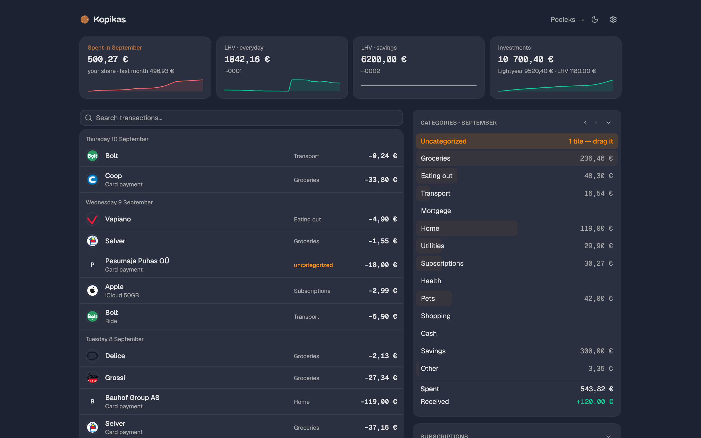

# Kopikas

A personal money board fed by LHV bank data. Transactions arrive as one ruled statement, and you file them by dragging. Named after the humble coin: *iga kopikas loeb*, every penny counts.



## Why

Bank apps are built for a phone: tiny numbers, one transaction at a time, no way to see a month at once. Kopikas is the opposite. It wants a big screen, shows the whole month as a ledger, and turns categorising into a physical gesture. Drop a charge on a category, tick *always*, and every past and future charge from that merchant files itself. Two thousand transactions sort themselves in an afternoon.

It is built for one household. Two people sign in, one owns the board and the other sees the shared page. There is no multi-tenant anything, and that is deliberate.

## What is on the board

The ledger is the middle column: every transaction, newest first, grouped by day, with the merchant's real name and favicon instead of the bank's shouting string. Card payments are one line. Transfers keep their payment note. Shared rows wear a faint purple wash. Search and a month switcher sit above it, and the current view lives in the URL (`?cat`, `?month`, `?q`), so a filtered month is a link you can keep.

The rail on the right holds three cards.

Categories are a fixed list in `lib/engine.ts`. Each row shows this month's total with a copper bar for its share of the largest, and each row is a drop target. A drop asks whether to file just this one or *always*; *always* writes a rule, which is a lowercase substring matched against the counterparty and description. Rules are listed and deleted on the Settings page. Money coming in is not a category, it is the Received line under Spent, and clicking it shows who sent what.

Subscriptions watches recurring charges. Drop one on the zone and the board records the merchant pattern and expected amount, then tracks the last charge, the next due date, and whether the price moved. A price change shows as a badge you click to accept the new price. A charge that stops arriving shows as gone quiet. Rows group into monthly and yearly, with the monthly burn at the bottom; the guess between the two reads the statement text when there is only one charge to go on, and a control on each row corrects it.

Pooleks (Estonian for *in half*) is the shared ledger. Drop a charge on the zone with a 1/2, 1/3 or 1/4 split and it becomes a line on a running statement of who owes whom. The partner signs in and sees the same statement with the labels flipped, plus a dialog to add what they paid for. Settle up records a repayment. The Splitwise replacement, straight from bank rows, with nothing typed twice.

The stat row across the top shows this month's spend against last month, the account balances with a 30-day line each, and an Investments tile. LHV's API only gained investment endpoints in September 2026, so the two pots (a Lightyear account and the LHV investment account) are still tracked by manual snapshot and charted over time. Wiring the new endpoints is next.

## How it is built

Next.js 16 on the App Router, React 19, TypeScript, Tailwind v4, shadcn/ui on Base UI. Drag and drop is dnd-kit. The ledger's enter and exit animation is Motion, one flat presence for headers and rows alike. Charts are recharts. Sign-in is Clerk. Production runs on Vercel with Postgres on Neon.

One storage module, `lib/storage.ts`, hides two adapters behind the same interface. With `DATABASE_URL` set it talks to Postgres; without it, each collection is a JSON file under `data/`. Both seed mock data into an empty store on first read, so `npm run dev` with no configuration at all gives you a working board with invented merchants and amounts. That is how the screenshots were made. `data/` is gitignored, so nothing real can end up in the repo by accident.

Merchant identity lives in `lib/icons.ts`: a small table of known merchants with a favicon domain and a display name, matched on the counterparty or, for card payments that only carry a merchant id, on the description. Unknown ALL-CAPS strings are title-cased. Favicons are fetched once by the server and cached in the database, so the merchant list never leaves the app from a viewer's browser.

Design notes, for the curious: copper accent from the coin, Geist for text and Geist Mono for amounts with tabular figures, Bricolage Grotesque for the wordmark, green and red reserved for money in and money out, purple for shared, amber for things that need filing.

## The LHV integration

LHV exposes a read-only API at `api.lhv.ai/api/v1` (in beta) with OAuth2 and two scopes, `accounts:read` and `transactions:read`. Everything Kopikas knows about it is in `lib/lhv.ts`, 265 lines, and most of it was learned the hard way:

- The refresh grant needs `client_id=api-access`. The docs' curl example shows it, the prose does not.
- Refresh tokens rotate on every use. The new one is persisted immediately, sealed with AES-256-GCM in the database, because storing it in an environment variable breaks on the second sync.
- Access tokens live 15 minutes in practice, not the hour the setup page states. Every sync refreshes first.
- Statements are fetched in slices of at most 90 days, so a backfill of a whole year is three requests per account.
- Card payments carry the merchant inside the description string, along with the card tail, a timestamp and an address. `merchantFromDescription` pulls the name out.

To connect an account, open [api.lhv.ai/api-access](https://api.lhv.ai/api-access), authenticate with Smart-ID, Mobile-ID or ID-card, and paste the refresh token into the Settings page. From then on the sync keeps itself alive as long as it runs at least once every 30 days.

Sync runs from two places, because Vercel's free tier allows one cron a day: a Vercel cron at 05:00 UTC as the backstop, and a GitHub Actions workflow every hour at :07 that calls `/api/sync` with a bearer token. The route is idempotent, so overlaps are harmless. `/api/sync?full=1` refetches the last 90 days for retroactive fixes, and `/api/sync?since=2026-01-01` backfills history.

## Running it locally

```bash
git clone https://github.com/argotornik/kopikas.git
cd kopikas
npm install
npm run dev
```

Open http://localhost:3000. Without Clerk keys there is no sign-in and you are the owner. Without a database the board runs on mock data in `data/`; delete that folder to reseed. `npm run build` is the type-check, since `next dev` does not run one.

## Deploying your own

You need a Vercel project pointed at the repo, a Neon database, and a Clerk application. Run `db/schema.sql` against the database once; the app adds the few columns it has grown since then on its own.

| Variable | What it is |
|---|---|
| `DATABASE_URL` | Neon connection string. Absent means JSON files under `data/`. |
| `ENCRYPTION_KEY` | 32 bytes, base64, seals the LHV token row. `openssl rand -base64 32`. |
| `LHV_CLIENT_ID` | `api-access`, the public client id LHV's refresh grant requires. |
| `CRON_SECRET` | Bearer token the sync route expects. Also set as a GitHub Actions secret. |
| `CLERK_SECRET_KEY` | Clerk. Absent means auth is off and everyone is the owner. |
| `NEXT_PUBLIC_CLERK_PUBLISHABLE_KEY` | Clerk, client side. |
| `ARGO_EMAIL` | The owner's sign-in email. Everything. |
| `PARTNER_EMAIL` | The partner's sign-in email. Pooleks and adding shared expenses only. |
| `NEXT_PUBLIC_PARTNER_NAME` | How the partner is named on screen. Optional, defaults to Partner. |

In Clerk, turn sign-up off and create the two users by hand; the app trusts the email on the session and nothing else. For the hourly sync, add `CRON_SECRET` as a repository secret and, if the app is not at the default URL, `SYNC_URL` as a repository variable. `/api/version` is public and returns the deployed commit, which is the quickest way to see whether a push has landed.

## Things to know

The categories, the two investment pots and the two sign-in roles are hard-coded to one household's life. Making any of them configurable is a small change, it just has not been needed.

Only LHV is supported. Another bank means implementing the two fetch functions in `lib/lhv.ts` against its API and mapping into the same transaction shape.

There are no automated tests. The type checker is strict and the mock board is the manual one.

The LHV API is in beta and changed during the build. If the sync starts returning empty, check `lhv.ai` before checking the code.

## License

MIT.
