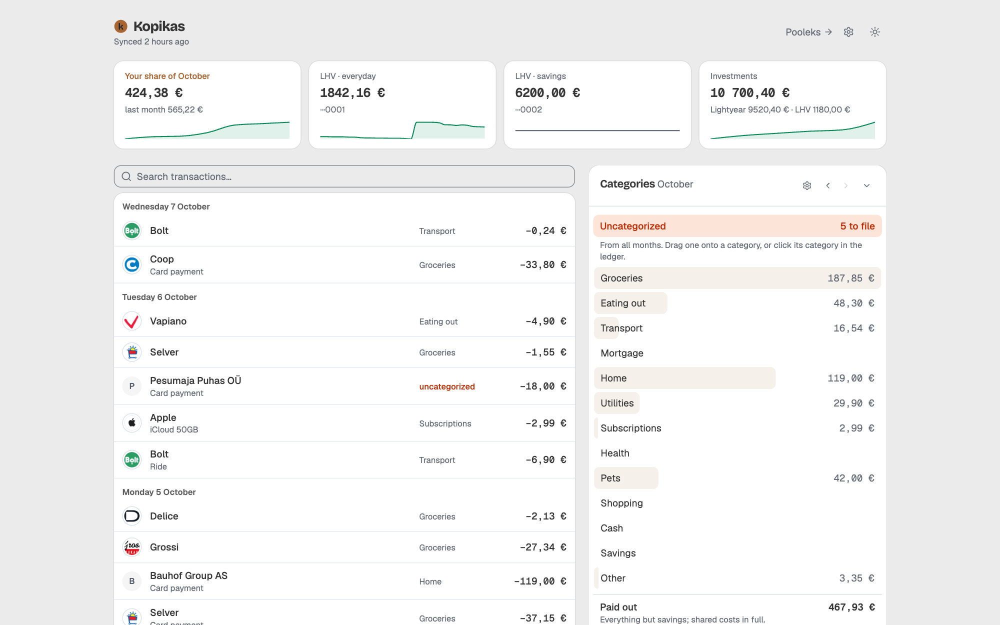
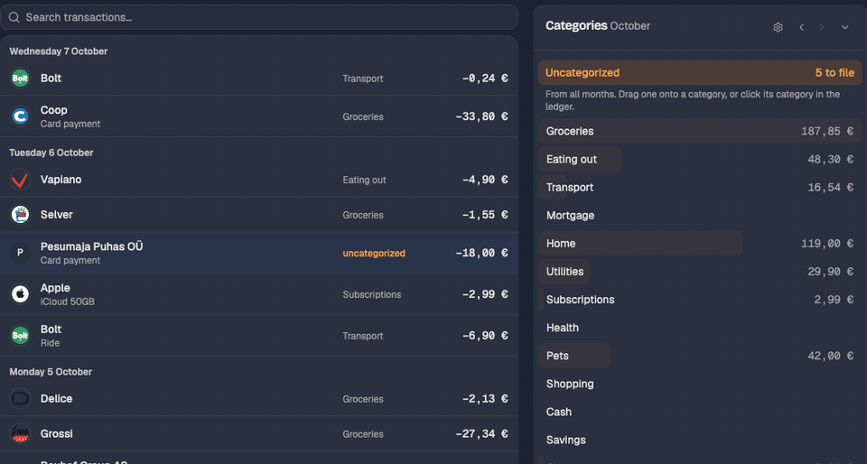
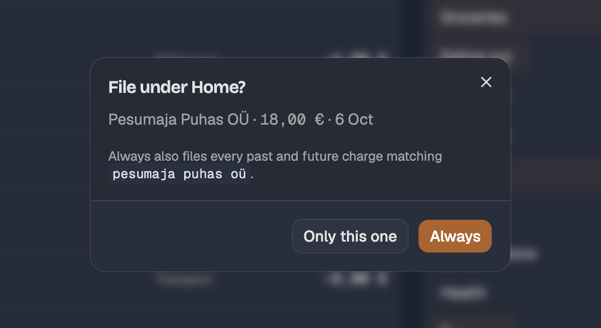
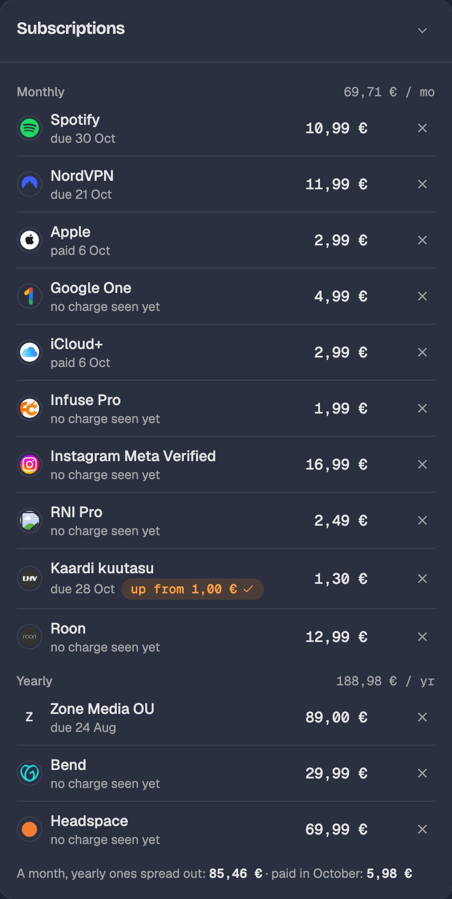
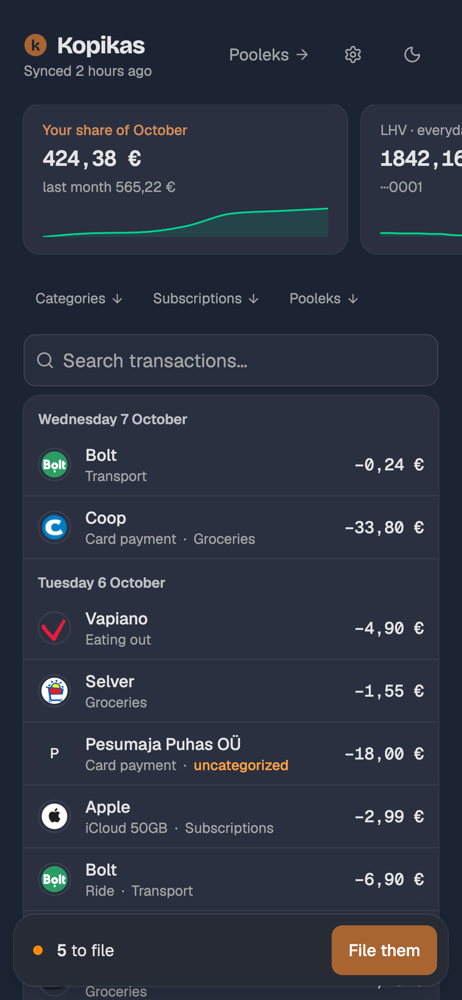
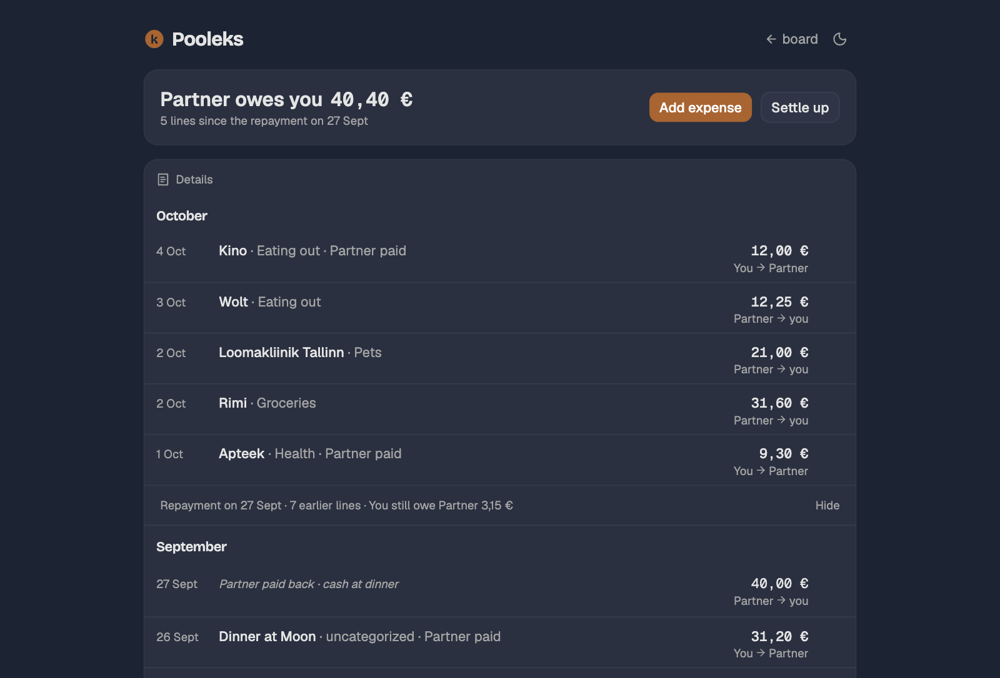

# Kopikas

A personal money board fed by LHV bank data. Transactions arrive as one ruled statement, and you file them by dragging. Named after the humble coin: *iga kopikas loeb*, every penny counts.

<picture>
  <source media="(prefers-color-scheme: dark)" srcset="docs/board-dark.png">
  
</picture>

## Why

Bank apps are built for a phone: tiny numbers, one transaction at a time, no way to see a month at once. Kopikas wants a big screen. It shows the whole month as one ledger, and categorising becomes a physical gesture: drop a charge on a category, tick *always*, and every past and future charge from that merchant files itself. Two thousand transactions sort themselves in an afternoon.

It is built for one household. Two people sign in, one owns the board and the other sees the shared page. There is no multi-tenant anything.

## What is on the board

The ledger is the middle column: every transaction, newest first, grouped by day, with the merchant's real name and favicon instead of the bank's shouting string. Click the icon, here or on a subscription row, to give a merchant your own name, a website for its favicon, or an emoji; it applies to every charge from that merchant. Card payments are one line. Transfers keep their payment note. Shared rows wear a faint purple wash. Search sits above it and matches the names you see, not only the bank's strings. The current view lives in the URL (`?cat`, `?month`, `?q`), so a filtered month is a link you can keep.

A row's category is also a button. It opens a menu with every category, the split with the partner, and the merchant's name and icon, so everything a drag can do works from the keyboard too.

The rail on the right puts every drop target at the top: the categories card, then a strip with the two other places a charge can go, Track as a subscription and Split with the partner. Below them sit the cards you only read: subscriptions, the Pooleks balance and investments over time. While a charge is in the air the reading cards fold away and every target is outlined, so they all fit on screen.

Categories start as a default list, and a cog on the card renames them, adds new ones or drags them into a new order; a rename carries every rule and filed charge along. Arrows in the card's header step through the months. Each row shows the month's total with a copper bar for its share of the largest, and each row is a drop target. Give a category a monthly limit in the same dialog and its bar becomes a meter against the limit, amber once it is passed. Select a category and a twelve-month strip appears above the ledger: a bar per month, the average as a line, the limit as another; click a month to move the card there. A drop asks whether to file just this one or *always*; *always* writes a rule, which is a lowercase substring matched against the counterparty and description. Rules are listed on the Settings page, grouped by the category they file into, with the ones that match nothing gathered first. Under the categories, Paid out is everything that left the account that month except savings, shared costs at full price. Incoming money has its own line, Received; clicking it shows who sent what.





Subscriptions watches recurring charges. Drop one on Track as a subscription, or on the Subscriptions row in the categories card, and the board records the merchant pattern and expected amount, then tracks the last charge, the next due date, and whether the price moved. A price change shows as a badge you click to accept the new price. A charge that stops arriving shows as gone quiet. Rows group into monthly and yearly, with a per-month total at the bottom that spreads the yearly ones over twelve months; the guess between the two reads the statement text when there is only one charge to go on, re-measures itself once a second charge lands, and a control on each row corrects it for good.

<p>
  
  
</p>

Pooleks (Estonian for *in half*) is the shared ledger. Drop a charge on Split with the partner, with a 1/2, 1/3 or 1/4 split, and it becomes a line on a running statement of who owes whom. Each line shows its amount and an arrow: who owes whom for a shared cost, who paid whom for a repayment. Choose Always and every future charge from that merchant lands on the statement by itself at the same split; past charges are left alone, and the rule can be removed on Settings. The partner signs in and sees the same statement with the labels flipped, plus a dialog to add what they paid for. Either of you records a repayment with Settle up, which shows what the amount would leave open before it is recorded; either can remove one, and new ones say who recorded them. Everything before the latest repayment folds into one line, so the statement shows what is open. This is what replaced Splitwise here: the rows come from the bank, so nothing is typed twice.



The stat row across the top shows your share of this month's spending against last month (shared costs at your part), the account balances with a 30-day line each, and an Investments tile. The LHV investment account is read from the API on every sync, one snapshot a day refreshed through the day; the Lightyear pot has no API and is entered by hand. Both are charted over time. Under the wordmark, the board says when it last heard from LHV; past 26 hours that line turns amber and links to Settings.

Most one-click changes can be taken back: forgetting a rule, taking a charge off Pooleks, cancelling a subscription, accepting a new price, recording or removing a repayment. A notice offers Undo for a few seconds, and ⌘Z or Ctrl+Z does the same. When a change fails, the page says why instead of pretending it worked.

On a phone the board is one column. The stat tiles become a row you swipe, a bar at the foot of the screen counts what is left to file, and tapping it narrows the ledger to that queue. Tapping a row opens a sheet with every category as a large button; each filed row leaves, and the next one is where your thumb is. Filing a backlog is the phone's job; seeing the month at once is still the big screen's.

## How it is built

Next.js 16 on the App Router, React 19, TypeScript, Tailwind v4, shadcn/ui on Base UI. Drag and drop is dnd-kit, for the mouse; the keyboard and touch file through a Base UI menu and a sheet. The ledger's enter and exit animation is Motion, one flat presence for headers and rows alike. Rows are memoised and compare the fields they show, so a thousand of them only redraw when they change, and an action's reply carries the fresh board, so a change is one request. Charts are recharts. Sign-in is Clerk. Production runs on Vercel with Postgres on Neon.

One storage module, `lib/storage.ts`, hides two adapters behind the same interface. With `DATABASE_URL` set it talks to Postgres and creates or updates its own tables on first start; without it, each collection is a JSON file under `data/`. The JSON adapter seeds mock data into an empty folder, so `npm run dev` with no configuration at all gives you a working board with invented merchants and amounts. That is how the screenshots were made. Production starts empty and asks you to connect LHV. `data/` is gitignored, so nothing real can end up in the repo by accident.

Merchant identity lives in `lib/icons.ts`: a small table of known merchants with a favicon domain and a display name, matched on the counterparty or, for card payments that only carry a merchant id, on the description. Unknown ALL-CAPS strings are title-cased. Favicons are fetched once by the server and cached in the database, so the merchant list never leaves the app from a viewer's browser.

Design notes: copper accent from the coin, Geist for text and Geist Mono for amounts with tabular figures, Bricolage Grotesque for the wordmark and the section heads, green and red reserved for money in and money out, purple for shared, amber for things that need filing. The colours that are also fills have a darker shade for text, which reads at 4.5:1 in both themes.

## The LHV integration

LHV exposes a read-only API at `api.lhv.ai/api/v1` (in beta) with OAuth2 and two scopes, `accounts:read` and `transactions:read`. Everything Kopikas knows about it is in `lib/lhv.ts`, 355 lines, and most of it was learned the hard way:

- The refresh grant needs `client_id=api-access`. The docs' curl example shows it, the prose does not.
- Refresh tokens rotate on every use. The new one is persisted immediately, sealed with AES-256-GCM in the database, because storing it in an environment variable breaks on the second sync.
- Access tokens live 15 minutes in practice, not the hour the setup page states. Every sync refreshes first.
- Statements are fetched in slices of at most 90 days, so a backfill of a whole year is three requests per account.
- Card payments carry the merchant inside the description string, along with the card tail, a timestamp and an address. `merchantFromDescription` pulls the name out.
- Investment positions come from `/investments/balances`: every investment account in one call, with a portfolio total and per-position market values. It needs only the accounts scope.

To connect an account, open [api.lhv.ai/api-access](https://api.lhv.ai/api-access), authenticate with Smart-ID, Mobile-ID or ID-card, and paste the refresh token into the Settings page. The token is tried against LHV before it replaces the stored one, so a mistyped or expired token never overwrites one that works. From then on the sync keeps itself alive as long as it runs at least once every 30 days. When a sync fails, the message names the cause, whether the network, the sign-in, LHV refusing the token or LHV being down, with the raw report folded away underneath.

Sync runs from two places, because Vercel's free tier allows one cron a day: a Vercel cron at 05:00 UTC as the backstop, and a GitHub Actions workflow every hour at :07 that calls `/api/sync` with a bearer token. The route is idempotent, so overlaps are harmless. `/api/sync?full=1` refetches the last 90 days for retroactive fixes, and `/api/sync?since=2026-01-01` backfills history.

## Running it locally

```bash
git clone https://github.com/argotornik/kopikas.git
cd kopikas
npm install
npm run dev
```

Open http://localhost:3000. Without Clerk keys there is no sign-in and you are the owner. Without a database the board runs on mock data in `data/`; delete that folder to reseed. `KOPIKAS_EMPTY=1 npm run dev` starts with nothing instead, which is how to see the first-run screen. `npm run build` is the type-check, since `next dev` does not run one.

## Deploying your own

[](https://vercel.com/new/clone?repository-url=https%3A%2F%2Fgithub.com%2Fargotornik%2Fkopikas&project-name=kopikas&repository-name=kopikas&env=ENCRYPTION_KEY,CRON_SECRET,OWNER_EMAIL,NEXT_PUBLIC_OWNER_NAME&envDescription=See%20the%20table%20under%20%22Deploying%20your%20own%22%20in%20the%20README&envLink=https%3A%2F%2Fgithub.com%2Fargotornik%2Fkopikas%23deploying-your-own)

You need a Vercel project pointed at the repo, a Neon database, and a Clerk application. The Neon and Clerk integrations on the Vercel Marketplace set `DATABASE_URL` and the Clerk keys for you. The app creates its tables on first start. Sign in, and an empty board walks you through connecting LHV: get a token, paste it, press Connect. The first sync runs and the board opens.

| Variable | What it is |
|---|---|
| `DATABASE_URL` | Neon connection string. Absent means JSON files under `data/`. |
| `ENCRYPTION_KEY` | A secret of your own, 16 characters or more, that seals the LHV token row. Any long passphrase works; a 32-byte base64 key is used as is. |
| `CRON_SECRET` | A second secret of your own. The sync route expects it as a bearer token, and the GitHub Actions workflow sends it. |
| `LHV_CLIENT_ID` | Optional. LHV's public client id for the refresh grant, `api-access` unless LHV changes it. |
| `CLERK_SECRET_KEY` | Clerk. Absent means auth is off and everyone is the owner. |
| `NEXT_PUBLIC_CLERK_PUBLISHABLE_KEY` | Clerk, client side. |
| `OWNER_EMAIL` | The owner's sign-in email. Everything. |
| `NEXT_PUBLIC_OWNER_NAME` | How the owner is named on the partner's screens. Optional, defaults to Owner. |
| `PARTNER_EMAIL` | The partner's sign-in email. Pooleks and adding shared expenses only. |
| `NEXT_PUBLIC_PARTNER_NAME` | How the partner is named on screen. Optional, defaults to Partner. |

In Clerk, turn sign-up off and create the two users by hand; the app trusts the email on the session and nothing else. For the hourly sync, add `CRON_SECRET` as a repository secret and `SYNC_URL`, your deployment's `/api/sync` address, as a repository variable. `/api/version` is public and returns the deployed commit, which is the quickest way to see whether a push has landed.

## Things to know

The two investment pots and the two sign-in roles are hard-coded to one household's life. Making them configurable is a small change, it just has not been needed. Categories can be renamed, added and reordered from the board, but not deleted yet.

Only LHV is supported. Another bank means implementing the two fetch functions in `lib/lhv.ts` against its API and mapping into the same transaction shape.

`npm test` runs the engine tests on Node's built-in runner, no extra dependency: the rule matcher and category maths, the Pooleks balance, subscription cadence and status, merchant naming, the LHV mappers and token check, putting back what Undo restores, reading typed amounts, and the wording of sync results. GitHub Actions runs them on every push and pull request. The type checker is strict, and the mock board is the manual test for the interface.

The LHV API is in beta and changed during the build. If the sync starts returning empty, check `lhv.ai` before checking the code.

## Credits

The painted look of the coin tray prototype (`/coins`) and of Kopikas there, with flat colour, soft round shapes and faces of two dots and a curve, follows the tufted characters of KAIA ([@saiakuubik](https://www.instagram.com/saiakuubik/)), and is used with her permission.

## License

MIT.
